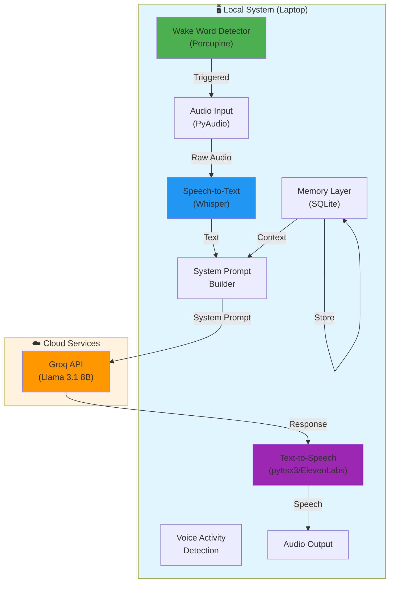
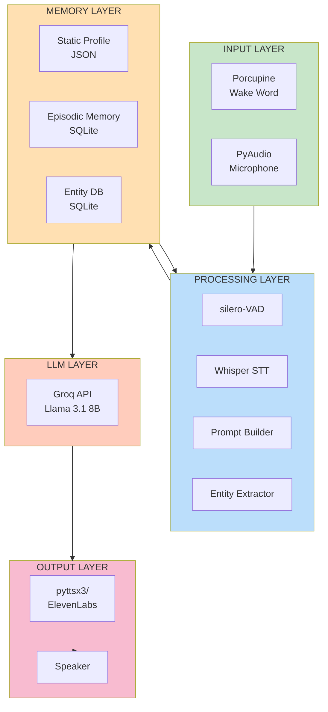
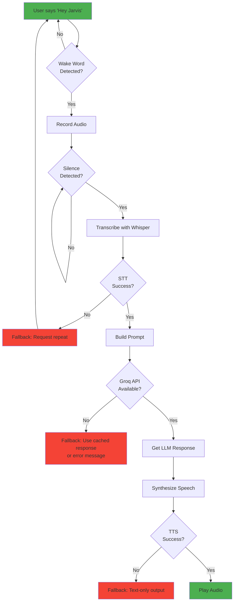
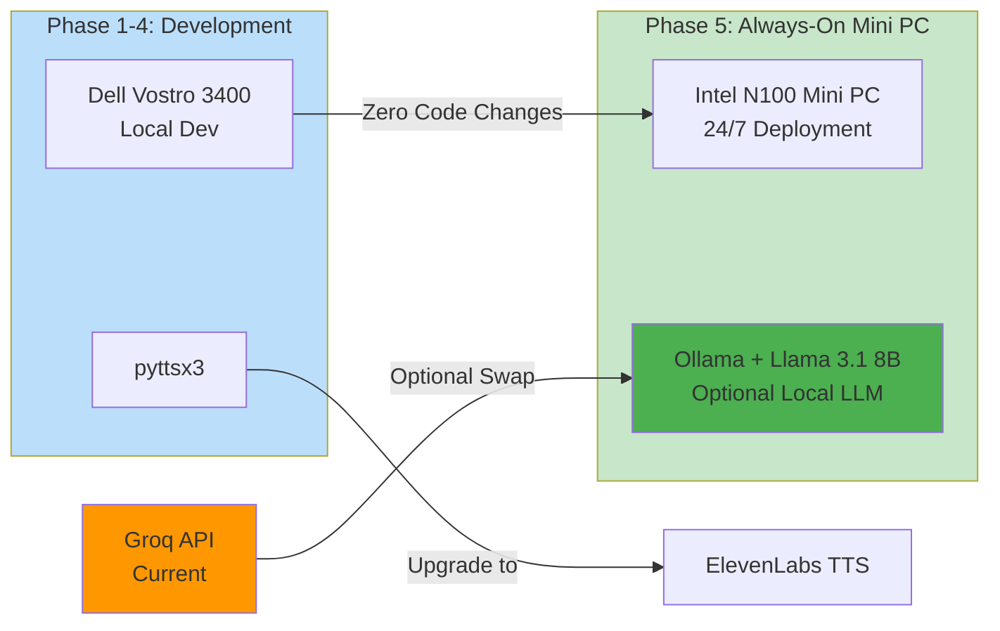

# Project Jarvis - System Architecture

## 1. High-Level System Overview



---

## 2. Detailed Audio Pipeline

```mermaid
graph LR
    A["🎤 Microphone"] -->|Raw Audio Stream| B["Porcupine<br/>Wake Word Detector"]
    B -->|'Hey Jarvis' Detected| C["Record Audio<br/>Frames"]
    C -->|Audio Buffer| D["silero-VAD<br/>Detect Speech"]
    D -->|Speech Ends| E["Trim Silence<br/>& Normalize"]
    E -->|Clean Audio| F["Whisper STT<br/>tiny.en model"]
    F -->|Transcribed Text| G["SQLite Episodic<br/>Memory Log"]
    F -->|User Query| H["Prompt Builder"]
    G -->|Recent History| H
    I["Static Profile<br/>JSON"] -->|Context| H
    H -->|Full System Prompt| J["Groq API<br/>Llama 3.1 8B"]
    J -->|Generated Response| K["Entity Extractor<br/>Parse & Store"]
    K -->|New Facts| G
    K -->|Response Text| L["pyttsx3 TTS<br/>or ElevenLabs"]
    L -->|Speech| M["🔊 Speaker Output"]
    
    style A fill:#4caf50
    style B fill:#4caf50
    style J fill:#ff9800
    style M fill:#9c27b0
```



---

## 3. Memory Architecture

### 3.1 Three-Layer Memory System

```
┌─────────────────────────────────────────────────────────────┐
│                    MEMORY LAYER ARCHITECTURE                 │
├─────────────────────────────────────────────────────────────┤
│                                                               │
│  Layer 1: STATIC PROFILE (JSON File)                         │
│  ├─ User identity & bio                                      │
│  ├─ Current projects & status                                │
│  ├─ Work context & responsibilities                          │
│  ├─ Preferences & communication style                        │
│  └─ Long-term goals                                          │
│                                                               │
│  Layer 2: EPISODIC MEMORY (SQLite)                           │
│  ├─ Conversations table (timestamps, full history)           │
│  ├─ Entity facts table (extracted knowledge)                 │
│  ├─ Query-response pairs for retrieval                       │
│  └─ Context windows for relevant history                     │
│                                                               │
│  Layer 3: REAL-TIME CONTEXT (In-Memory Cache)                │
│  ├─ Last N conversation exchanges                            │
│  ├─ Current session state                                    │
│  ├─ Extracted entities from current query                    │
│  └─ Active project context                                   │
│                                                               │
└─────────────────────────────────────────────────────────────┘

Flow: Profile → Load → Retrieve History → Inject Context → Query LLM
      ↓
      Store Response → Extract Entities → Update Memory
```

---

## 4. Component Interaction Diagram



---

## 5. System Prompt Architecture

```
┌────────────────────────────────────────────────────────────┐
│               SYSTEM PROMPT COMPOSITION                     │
├────────────────────────────────────────────────────────────┤
│                                                              │
│ [Base Identity]                                              │
│ "You are Jarvis, the personal AI assistant of Asghar Ali"   │
│                                                              │
│ + [Static Profile Context]                                  │
│ • Background: FAST-NUCES student, B.S. CS 2026             │
│ • Current Projects: FYP deadline June 20, personal brand    │
│ • Interests: AI, systems design, content creation           │
│ • Work: Software dev, marketing, multiple roles             │
│                                                              │
│ + [Recent Conversation History] (Last 5-10 exchanges)       │
│ Q: "What's the status of my FYP?"                          │
│ A: "Your FYP is... [context specific response]"            │
│                                                              │
│ + [Extracted Entity Facts]                                  │
│ - FYP deadline: June 20, 2026                               │
│ - Current focus: System design work                         │
│ - Last mentioned project: Jarvis (this assistant)           │
│                                                              │
│ + [Current Context]                                         │
│ - Today's date: June 22, 2026                               │
│ - Time: [current time]                                      │
│ - Active projects mentioned this session                    │
│                                                              │
│ + [Behavioral Instructions]                                 │
│ - Be concise but contextually aware                         │
│ - Reference past conversations naturally                    │
│ - Offer help proactively based on known projects            │
│ - Remember preferences (response style, formats)            │
│                                                              │
└────────────────────────────────────────────────────────────┘
```

---

## 6. Error Handling & Fallback Flow



---

## 7. Data Flow - Complete Query Cycle

```
USER: "Hey Jarvis, what's the status of my FYP?"

1. DETECTION PHASE
   └─ Porcupine detects "Hey Jarvis"
   └─ Audio recording starts

2. CAPTURE & VAD PHASE
   └─ PyAudio captures raw audio frames
   └─ silero-VAD detects speech end (silence > 1s)
   └─ Audio trimmed and normalized

3. TRANSCRIPTION PHASE
   └─ Whisper STT converts: "what's the status of my FYP?"
   └─ Confidence score checked (reject if < 60%)

4. CONTEXT RETRIEVAL PHASE
   └─ Load static profile from JSON
   └─ Query SQLite episodic memory:
      • Last 10 conversations mentioning "FYP"
      • Last 5 entity facts about FYP deadline
   └─ Entity extraction on query:
      • "FYP" → known project, deadline June 20
      • "status" → requires factual update

5. PROMPT BUILDING PHASE
   └─ Compose system prompt:
      ┌─────────────────────────────────────────┐
      │ You are Jarvis...                        │
      │ Background: FAST student, CS 2026...    │
      │ Current Projects: FYP deadline June 20  │
      │                                          │
      │ Recent history:                         │
      │ Q: "How's the Jarvis project?"         │
      │ A: "Development is progressing..."      │
      │                                          │
      │ User Query: "what's status of my FYP?"  │
      └─────────────────────────────────────────┘

6. LLM INFERENCE PHASE
   └─ Send to Groq API (Llama 3.1 8B)
   └─ Tokens/sec: 200+ for fast response
   └─ Response: "Your FYP is on track. Latest work 
               involved implementing the memory layer..."

7. ENTITY EXTRACTION PHASE
   └─ Parse response for new facts
   └─ Extract: "FYP memory layer implemented"
   └─ Store in SQLite entity table with timestamp

8. SYNTHESIS & OUTPUT PHASE
   └─ pyttsx3 converts response to audio
   └─ Play through speaker (~2 seconds)

TOTAL TIME: ~2.5-3 seconds (target met)

9. MEMORY UPDATE PHASE
   └─ Store conversation exchange:
      • Query: "what's status of my FYP?"
      • Response: "Your FYP is..."
      • Timestamp: 2026-06-22 14:35:12
      • Entities: ["FYP", "memory layer"]
      • Session: active
```

---

## 8. Component Responsibilities

| Component | Responsibility | Input | Output |
|-----------|-----------------|-------|--------|
| **Porcupine** | 24/7 wake word detection | Audio stream | Boolean trigger |
| **PyAudio** | Mic input & speaker output | N/A | Audio frames / Write signal |
| **silero-VAD** | Detect speech start/end | Audio buffer | Voice activity confidence |
| **Whisper STT** | Convert speech to text | Audio (WAV) | Text string + confidence |
| **SQLite Memory** | Store & retrieve context | Queries | Conversation history, entities |
| **Prompt Builder** | Construct system prompt | Profile + history | Full system prompt string |
| **Entity Extractor** | Parse & store facts | Response text | Entities + metadata |
| **Groq API** | Generate intelligent response | System prompt + user query | LLM response text |
| **TTS (pyttsx3)** | Convert text to speech | Response text | Audio frames |
| **TTS (ElevenLabs)** | Premium voice synthesis | Response text | High-quality audio |

---

## 9. Latency Budget

```
Target End-to-End: < 3 seconds

Breakdown:
├─ Wake word detection: ~50ms (continuous)
├─ Audio capture (up to speech end): ~1000-2000ms
├─ VAD processing: ~100ms
├─ Whisper STT: ~1000-1500ms (tiny.en on CPU)
├─ Prompt building: ~50ms
├─ Network latency (Groq): ~200-300ms
├─ Groq LLM inference: ~500-800ms (200+ tokens/sec)
├─ TTS synthesis: ~500-1000ms
└─ Playback + overhead: ~200ms

Total: ~2.6-3.5 seconds (acceptable range)

Optimization Points:
• Use Whisper.tiny.en (English-only, faster)
• Parallel network request preparation
• Cache static profile (avoid reload)
• Async TTS synthesis
```

---

## 10. Scalability & Migration Path



**Key Design Principle**: All components are independently swappable without affecting others.

---

## 11. Security & Privacy Considerations

```
┌───────────────────────────────────────────────────┐
│           DATA FLOW SECURITY MODEL                 │
├───────────────────────────────────────────────────┤
│                                                    │
│ LOCAL (No external access)                        │
│ ├─ Porcupine audio processing (on-device)         │
│ ├─ Whisper STT (offline, local)                   │
│ ├─ SQLite memory database                         │
│ ├─ Static user profile JSON                       │
│ └─ Audio files (temporary, deleted after STT)     │
│                                                    │
│ EXTERNAL (Only text queries sent)                 │
│ ├─ Groq API: Receives only transcribed text       │
│ └─ No personal data in API requests               │
│                                                    │
│ FUTURE CONSIDERATIONS                             │
│ ├─ Optional local Ollama (full privacy mode)      │
│ ├─ Encrypted SQLite (for sensitive data)          │
│ └─ User-controlled data export/deletion           │
│                                                    │
└───────────────────────────────────────────────────┘
```

---

## 12. System Dependencies & External Services

| Service | Purpose | Cost | Fallback |
|---------|---------|------|----------|
| **Groq API** | LLM inference | Free tier | Local Ollama (Phase 5) |
| **Picovoice** | Wake word training | Free tier | Manual activation |
| **ElevenLabs** | Premium TTS | $5/mo optional | pyttsx3 (offline) |

---

## 13. Configuration & Environment

```yaml
# config.yaml (to be created in Phase 1)

porcupine:
  access_key: ${PICOVOICE_ACCESS_KEY}
  wake_word: "Hey Jarvis"
  sensitivity: 0.5  # Tune between 0-1

whisper:
  model: "tiny.en"  # Options: tiny, base, small
  language: "en"
  device: "cpu"

groq:
  api_key: ${GROQ_API_KEY}
  model: "llama-3.1-8b-instant"
  temperature: 0.7
  max_tokens: 500

memory:
  db_path: "./data/jarvis_memory.db"
  profile_path: "./data/user_profile.json"
  max_history_window: 10  # Recent exchanges to retrieve
  
vad:
  silence_threshold: 1.0  # seconds of silence to detect speech end
  
tts:
  engine: "pyttsx3"  # or "elevenlabs"
  rate: 150  # words per minute
  
logging:
  level: "INFO"
  file: "./logs/jarvis.log"
```

---

## Summary

This architecture provides:
- ✅ **Privacy**: All sensitive data stays local
- ✅ **Speed**: Target <3 second response time
- ✅ **Modularity**: Each component independently swappable
- ✅ **Scalability**: Clear path from laptop to always-on mini PC
- ✅ **Resilience**: Fallbacks for API failures
- ✅ **Personalization**: Three-layer memory ensures context awareness
