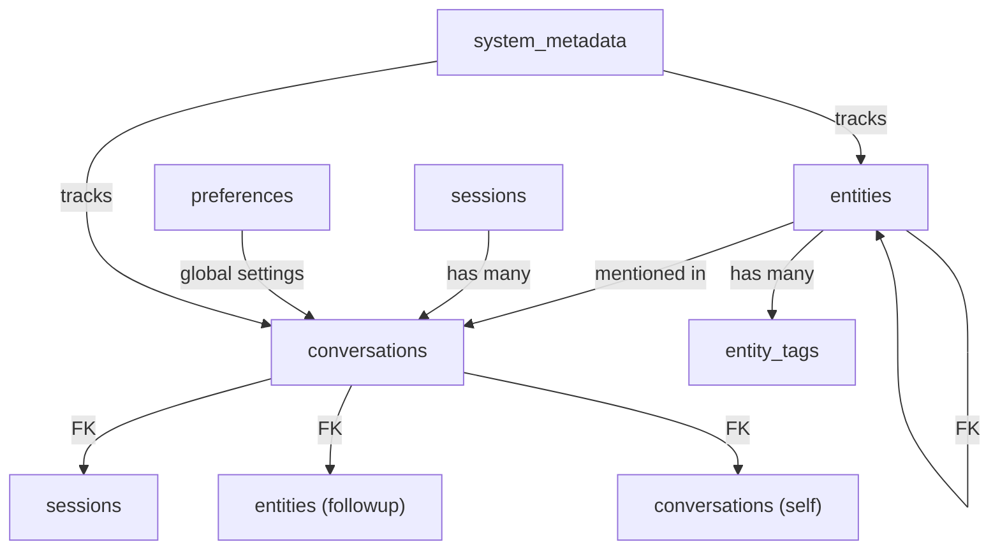

# Project Jarvis - Database Schema

## 1. Overview

The memory layer is built on SQLite with three main domains:
- **Conversations**: Historical Q&A exchanges
- **Entities**: Extracted facts and relationships
- **Profile Metadata**: System statistics and configuration

---

## 2. Database File Structure

```
jarvis_memory.db (SQLite database)
├─ conversations (table)
├─ entities (table)
├─ entity_tags (table)
├─ sessions (table)
├─ preferences (table)
└─ system_metadata (table)
```

---

## 3. Core Tables

### 3.1 `conversations` Table

Stores all query-response pairs with rich metadata for retrieval.

```sql
CREATE TABLE conversations (
    id INTEGER PRIMARY KEY AUTOINCREMENT,
    session_id INTEGER NOT NULL,
    
    -- Timestamp info
    timestamp TEXT NOT NULL,  -- ISO 8601: 2026-06-22T14:35:12.123Z
    date_created DATE NOT NULL,
    
    -- User query
    user_query TEXT NOT NULL,
    query_cleaned TEXT NOT NULL,  -- Lowercase, no punctuation
    query_confidence REAL,  -- Whisper confidence 0-1
    query_language TEXT DEFAULT 'en',
    
    -- AI response
    ai_response TEXT NOT NULL,
    response_tokens INTEGER,
    response_latency_ms INTEGER,  -- Time to get response from Groq
    
    -- Semantic info
    intent TEXT,  -- Extracted intent: "query", "update", "reminder", etc.
    entities_mentioned TEXT,  -- JSON: ["FYP", "deadline", "project"]
    
    -- Quality metrics
    was_useful BOOLEAN,  -- User feedback (optional)
    followup_query_id INTEGER,  -- FK to next query if this was a followup
    
    -- Retrieval metadata
    is_archived BOOLEAN DEFAULT 0,
    archive_date TEXT,
    relevance_score REAL,  -- Updated periodically based on retrieval
    
    FOREIGN KEY (session_id) REFERENCES sessions(id),
    FOREIGN KEY (followup_query_id) REFERENCES conversations(id)
);

-- Indexes for fast retrieval
CREATE INDEX idx_conversations_session_timestamp 
    ON conversations(session_id, timestamp DESC);
CREATE INDEX idx_conversations_entities 
    ON conversations(entities_mentioned);
CREATE INDEX idx_conversations_date_created 
    ON conversations(date_created DESC);
```

**Data Example:**
```
id: 1
session_id: 1
timestamp: 2026-06-22T14:35:12Z
user_query: "Hey Jarvis, what's the status of my FYP?"
query_cleaned: "status of fyp"
ai_response: "Your FYP is on track for the June 20 deadline..."
intent: "status_query"
entities_mentioned: ["FYP", "deadline", "status"]
response_latency_ms: 847
was_useful: true
```

---

### 3.2 `entities` Table

Stores extracted facts and knowledge from conversations.

```sql
CREATE TABLE entities (
    id INTEGER PRIMARY KEY AUTOINCREMENT,
    
    -- Entity identification
    entity_name TEXT NOT NULL UNIQUE,  -- "FYP", "Personal Brand Project"
    entity_type TEXT NOT NULL,  -- "project", "person", "date", "preference", "goal"
    
    -- Hierarchical relationship
    parent_entity_id INTEGER,  -- For nested entities (e.g., FYP -> React component)
    
    -- Core information
    description TEXT,
    value TEXT,  -- E.g., for "FYP_deadline": "2026-06-20"
    
    -- Temporal info
    created_date TEXT,  -- When first mentioned
    last_updated TEXT,  -- Last time this entity was referenced
    last_mentioned_in_query_id INTEGER,
    
    -- Metadata
    confidence_level REAL,  -- How confident we are (0-1)
    frequency_count INTEGER DEFAULT 1,  -- How many times mentioned
    is_active BOOLEAN DEFAULT 1,  -- Still relevant?
    
    -- Relationships
    related_entities TEXT,  -- JSON: ["project_deadline", "project_status"]
    
    -- Tags for categorization
    tags TEXT,  -- JSON: ["work", "priority", "urgent"]
    
    -- Source tracking
    first_mention_source TEXT,  -- "manual", "conversation", "extraction"
    
    FOREIGN KEY (parent_entity_id) REFERENCES entities(id),
    FOREIGN KEY (last_mentioned_in_query_id) REFERENCES conversations(id)
);

-- Indexes
CREATE INDEX idx_entities_name ON entities(entity_name);
CREATE INDEX idx_entities_type ON entities(entity_type);
CREATE INDEX idx_entities_active ON entities(is_active);
CREATE INDEX idx_entities_last_updated ON entities(last_updated DESC);
```

**Data Examples:**
```
id: 1
entity_name: "FYP"
entity_type: "project"
description: "Final Year Project - Personal AI Assistant (Jarvis)"
created_date: 2026-06-01T10:00:00Z
last_updated: 2026-06-22T14:35:12Z
frequency_count: 23
tags: ["work", "priority", "active"]
is_active: true

---

id: 2
entity_name: "FYP_deadline"
entity_type: "date"
parent_entity_id: 1
value: "2026-06-20"
description: "Deadline for Final Year Project submission"
created_date: 2026-05-15T00:00:00Z
tags: ["deadline", "critical"]
is_active: true

---

id: 3
entity_name: "communication_preference"
entity_type: "preference"
value: "concise_with_context"
description: "User prefers short responses with relevant context"
tags: ["style", "interaction"]
frequency_count: 1
```

---

### 3.3 `entity_tags` Table

Provides flexible tagging system for entities (allows many-to-many).

```sql
CREATE TABLE entity_tags (
    id INTEGER PRIMARY KEY AUTOINCREMENT,
    entity_id INTEGER NOT NULL,
    tag TEXT NOT NULL,
    
    created_date TEXT,
    
    FOREIGN KEY (entity_id) REFERENCES entities(id),
    UNIQUE(entity_id, tag)
);

-- Index
CREATE INDEX idx_entity_tags_tag ON entity_tags(tag);
```

---

### 3.4 `sessions` Table

Tracks conversation sessions (for grouping related queries).

```sql
CREATE TABLE sessions (
    id INTEGER PRIMARY KEY AUTOINCREMENT,
    
    -- Session info
    session_name TEXT,  -- E.g., "Morning Briefing", "Work Session"
    session_type TEXT,  -- "active", "archived"
    
    -- Timeline
    start_time TEXT NOT NULL,  -- ISO 8601
    end_time TEXT,
    duration_minutes INTEGER,
    
    -- Metadata
    query_count INTEGER DEFAULT 0,
    total_tokens_used INTEGER DEFAULT 0,
    avg_response_latency_ms REAL,
    
    -- Context
    context_notes TEXT,  -- E.g., "FYP work session"
    is_active BOOLEAN DEFAULT 1,
    
    created_date TEXT NOT NULL
);

-- Index
CREATE INDEX idx_sessions_active ON sessions(is_active);
CREATE INDEX idx_sessions_start_time ON sessions(start_time DESC);
```

---

### 3.5 `preferences` Table

Stores user preferences and behavioral settings.

```sql
CREATE TABLE preferences (
    id INTEGER PRIMARY KEY AUTOINCREMENT,
    
    -- Preference key-value pairs
    preference_key TEXT NOT NULL UNIQUE,
    preference_value TEXT NOT NULL,
    
    -- Metadata
    category TEXT,  -- "interaction", "tts", "response_style", "reminder"
    data_type TEXT,  -- "string", "integer", "boolean", "json"
    
    created_date TEXT,
    last_modified TEXT,
    
    is_active BOOLEAN DEFAULT 1
);

-- Indexes
CREATE INDEX idx_preferences_key ON preferences(preference_key);
CREATE INDEX idx_preferences_category ON preferences(category);
```

**Data Examples:**
```
id: 1
preference_key: "response_style"
preference_value: "concise"
category: "interaction"

id: 2
preference_key: "tts_engine"
preference_value: "pyttsx3"
category: "tts"

id: 3
preference_key: "reminder_frequency"
preference_value: "daily"
category: "reminder"

id: 4
preference_key: "voice_confirmation_enabled"
preference_value: "true"
category: "interaction"
```

---

### 3.6 `system_metadata` Table

Stores system-level information and statistics.

```sql
CREATE TABLE system_metadata (
    id INTEGER PRIMARY KEY AUTOINCREMENT,
    
    metadata_key TEXT NOT NULL UNIQUE,
    metadata_value TEXT NOT NULL,
    
    last_updated TEXT,
    
    data_type TEXT  -- "integer", "string", "json"
);

-- Indexes
CREATE INDEX idx_metadata_key ON system_metadata(metadata_key);
```

**Data Examples:**
```
metadata_key: "total_conversations"
metadata_value: "147"

metadata_key: "total_entities"
metadata_value: "23"

metadata_key: "last_profile_update"
metadata_value: "2026-06-22T10:00:00Z"

metadata_key: "db_version"
metadata_value: "1.0"

metadata_key: "last_memory_cleanup"
metadata_value: "2026-06-15T00:00:00Z"
```

---

## 4. Database Queries - Common Patterns

### 4.1 Retrieve Recent Conversation History

```sql
-- Get last 10 conversations for context
SELECT 
    user_query, 
    ai_response, 
    timestamp
FROM conversations
WHERE session_id = ?
ORDER BY timestamp DESC
LIMIT 10;
```

### 4.2 Find Relevant Past Conversations

```sql
-- Search for conversations mentioning specific entities
SELECT 
    user_query,
    ai_response,
    timestamp,
    entities_mentioned
FROM conversations
WHERE entities_mentioned LIKE '%FYP%'
   OR entities_mentioned LIKE '%project%'
ORDER BY timestamp DESC
LIMIT 5;
```

### 4.3 Get Entity Context

```sql
-- Retrieve entity and all related information
SELECT 
    e.entity_name,
    e.value,
    e.description,
    e.last_updated,
    e.frequency_count,
    GROUP_CONCAT(et.tag) as tags,
    c.ai_response as last_context
FROM entities e
LEFT JOIN entity_tags et ON e.id = et.entity_id
LEFT JOIN conversations c ON c.id = e.last_mentioned_in_query_id
WHERE e.entity_name = 'FYP'
   AND e.is_active = 1;
```

### 4.4 Semantic Search - Find Relevant Memories

```sql
-- Find conversations related to current topic (entity-based)
SELECT 
    c.user_query,
    c.ai_response,
    c.timestamp,
    COUNT(CASE WHEN c.entities_mentioned LIKE ? THEN 1 END) as entity_match_count
FROM conversations c
WHERE c.is_archived = 0
   AND c.session_id IN (
       SELECT id FROM sessions 
       WHERE is_active = 1
       ORDER BY start_time DESC
       LIMIT 30
   )
GROUP BY c.id
ORDER BY entity_match_count DESC, c.timestamp DESC
LIMIT 5;
```

### 4.5 Update Entity Last Mentioned

```sql
-- After a conversation, update entity reference counts
UPDATE entities
SET 
    last_updated = datetime('now'),
    last_mentioned_in_query_id = ?,
    frequency_count = frequency_count + 1
WHERE entity_name IN (?, ?, ?);  -- List of entities in current response
```

### 4.6 Archive Old Conversations

```sql
-- Archive conversations older than 30 days
UPDATE conversations
SET 
    is_archived = 1,
    archive_date = datetime('now')
WHERE date_created < date('now', '-30 days')
   AND is_archived = 0;
```

---

## 5. Data Type Specifications

### Timestamps
- Format: ISO 8601 with milliseconds `2026-06-22T14:35:12.123Z`
- Storage: TEXT
- Always use UTC

### Confidence Scores
- Range: 0.0 - 1.0
- Storage: REAL
- Represents: Whisper confidence, extraction confidence, etc.

### JSON Fields
- Stored as TEXT
- Used for: entities_mentioned, related_entities, tags, preferences
- Example: `["FYP", "deadline", "project"]`

### Entity Types
- `project`: Task or project
- `person`: Mention of a person
- `date`: Temporal information
- `preference`: User preference or style
- `goal`: Objective or aspiration
- `tool`: Software or service mentioned
- `concept`: Abstract idea or topic

---

## 6. Constraints & Relationships



---

## 7. Initial Schema Setup Script

```sql
-- jarvis_memory_schema.sql
-- Initialize database with all tables

BEGIN TRANSACTION;

-- Sessions
CREATE TABLE sessions (
    id INTEGER PRIMARY KEY AUTOINCREMENT,
    session_name TEXT,
    session_type TEXT DEFAULT 'active',
    start_time TEXT NOT NULL,
    end_time TEXT,
    duration_minutes INTEGER,
    query_count INTEGER DEFAULT 0,
    total_tokens_used INTEGER DEFAULT 0,
    avg_response_latency_ms REAL,
    context_notes TEXT,
    is_active BOOLEAN DEFAULT 1,
    created_date TEXT NOT NULL
);
CREATE INDEX idx_sessions_active ON sessions(is_active);
CREATE INDEX idx_sessions_start_time ON sessions(start_time DESC);

-- Conversations
CREATE TABLE conversations (
    id INTEGER PRIMARY KEY AUTOINCREMENT,
    session_id INTEGER NOT NULL,
    timestamp TEXT NOT NULL,
    date_created DATE NOT NULL,
    user_query TEXT NOT NULL,
    query_cleaned TEXT NOT NULL,
    query_confidence REAL,
    query_language TEXT DEFAULT 'en',
    ai_response TEXT NOT NULL,
    response_tokens INTEGER,
    response_latency_ms INTEGER,
    intent TEXT,
    entities_mentioned TEXT,
    was_useful BOOLEAN,
    followup_query_id INTEGER,
    is_archived BOOLEAN DEFAULT 0,
    archive_date TEXT,
    relevance_score REAL,
    FOREIGN KEY (session_id) REFERENCES sessions(id),
    FOREIGN KEY (followup_query_id) REFERENCES conversations(id)
);
CREATE INDEX idx_conversations_session_timestamp 
    ON conversations(session_id, timestamp DESC);
CREATE INDEX idx_conversations_entities 
    ON conversations(entities_mentioned);
CREATE INDEX idx_conversations_date_created 
    ON conversations(date_created DESC);

-- Entities
CREATE TABLE entities (
    id INTEGER PRIMARY KEY AUTOINCREMENT,
    entity_name TEXT NOT NULL UNIQUE,
    entity_type TEXT NOT NULL,
    parent_entity_id INTEGER,
    description TEXT,
    value TEXT,
    created_date TEXT,
    last_updated TEXT,
    last_mentioned_in_query_id INTEGER,
    confidence_level REAL,
    frequency_count INTEGER DEFAULT 1,
    is_active BOOLEAN DEFAULT 1,
    related_entities TEXT,
    tags TEXT,
    first_mention_source TEXT,
    FOREIGN KEY (parent_entity_id) REFERENCES entities(id),
    FOREIGN KEY (last_mentioned_in_query_id) REFERENCES conversations(id)
);
CREATE INDEX idx_entities_name ON entities(entity_name);
CREATE INDEX idx_entities_type ON entities(entity_type);
CREATE INDEX idx_entities_active ON entities(is_active);
CREATE INDEX idx_entities_last_updated ON entities(last_updated DESC);

-- Entity Tags
CREATE TABLE entity_tags (
    id INTEGER PRIMARY KEY AUTOINCREMENT,
    entity_id INTEGER NOT NULL,
    tag TEXT NOT NULL,
    created_date TEXT,
    FOREIGN KEY (entity_id) REFERENCES entities(id),
    UNIQUE(entity_id, tag)
);
CREATE INDEX idx_entity_tags_tag ON entity_tags(tag);

-- Preferences
CREATE TABLE preferences (
    id INTEGER PRIMARY KEY AUTOINCREMENT,
    preference_key TEXT NOT NULL UNIQUE,
    preference_value TEXT NOT NULL,
    category TEXT,
    data_type TEXT,
    created_date TEXT,
    last_modified TEXT,
    is_active BOOLEAN DEFAULT 1
);
CREATE INDEX idx_preferences_key ON preferences(preference_key);
CREATE INDEX idx_preferences_category ON preferences(category);

-- System Metadata
CREATE TABLE system_metadata (
    id INTEGER PRIMARY KEY AUTOINCREMENT,
    metadata_key TEXT NOT NULL UNIQUE,
    metadata_value TEXT NOT NULL,
    last_updated TEXT,
    data_type TEXT
);
CREATE INDEX idx_metadata_key ON system_metadata(metadata_key);

COMMIT;
```

---

## 8. Maintenance & Archival Strategy

### Archive Policy
- Conversations older than **30 days** → Archive
- Archived conversations still searchable but deprioritized
- Keeps database size manageable

### Entity Lifecycle
- **Active**: Referenced in last 7 days
- **Dormant**: Not mentioned in 7-30 days
- **Inactive**: Not mentioned in >30 days

### Cleanup Tasks (Weekly)
```python
# Archive old conversations
DELETE FROM conversations 
WHERE date_created < date('now', '-30 days') 
  AND is_archived = 1;

# Update entity activity status
UPDATE entities 
SET is_active = 0 
WHERE last_updated < date('now', '-30 days');

# Consolidate metadata statistics
UPDATE system_metadata 
SET metadata_value = (SELECT COUNT(*) FROM conversations)
WHERE metadata_key = 'total_conversations';
```

---

## 9. Performance Optimization Tips

1. **Indexing Strategy**: All frequently-queried fields are indexed
2. **Query Optimization**: Use `LIMIT` on large result sets
3. **Batch Operations**: Group entity updates into single transactions
4. **JSON Efficiency**: Keep entity lists in JSON for fast LIKE searches
5. **WAL Mode**: Enable Write-Ahead Logging for concurrency

```python
# In Python setup
conn = sqlite3.connect('jarvis_memory.db')
conn.execute('PRAGMA journal_mode=WAL')
conn.execute('PRAGMA foreign_keys=ON')
```

---

## Summary

This schema provides:
- ✅ **Rich Context Storage**: Multi-layered memory system
- ✅ **Fast Retrieval**: Optimized indexes for common queries
- ✅ **Flexible Relationships**: Entities can relate to multiple topics
- ✅ **Scalability**: Easy to add new entity types or tables
- ✅ **Privacy**: All data local, no external storage
- ✅ **Maintainability**: Clear structure for future enhancements
