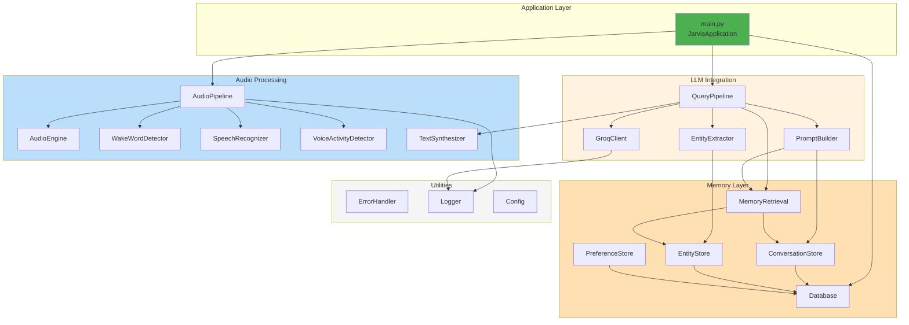

# Project Jarvis - Module Structure & Organization

## 1. Project Directory Layout

```
jj_assistant/
├── README.md
├── ARCHITECTURE.md                    # System architecture (this file)
├── DATABASE_SCHEMA.md                 # Database design
├── MODULE_STRUCTURE.md                # Module organization (this file)
│
├── src/
│   ├── __init__.py
│   ├── main.py                        # Entry point
│   ├── config.py                      # Configuration & environment variables
│   ├── constants.py                   # Constants and enums
│   │
│   ├── core/
│   │   ├── __init__.py
│   │   ├── audio_engine.py            # Audio I/O management (PyAudio, sounddevice)
│   │   ├── wake_word_detector.py      # Porcupine integration
│   │   ├── speech_recognizer.py       # Whisper STT
│   │   ├── voice_activity_detector.py # VAD (silero-vad)
│   │   └── text_synthesizer.py        # TTS (pyttsx3, ElevenLabs)
│   │
│   ├── llm/
│   │   ├── __init__.py
│   │   ├── groq_client.py             # Groq API integration
│   │   ├── prompt_builder.py          # System prompt construction
│   │   ├── response_handler.py        # LLM response processing
│   │   └── entity_extractor.py        # Extract facts from responses
│   │
│   ├── memory/
│   │   ├── __init__.py
│   │   ├── database.py                # SQLite connection & initialization
│   │   ├── conversation_store.py      # Conversation CRUD operations
│   │   ├── entity_store.py            # Entity management
│   │   ├── session_manager.py         # Session tracking
│   │   ├── preference_store.py        # User preference management
│   │   ├── memory_retrieval.py        # Semantic memory search & retrieval
│   │   └── archival.py                # Memory archival & cleanup
│   │
│   ├── pipeline/
│   │   ├── __init__.py
│   │   ├── audio_pipeline.py          # Main audio processing loop
│   │   ├── query_pipeline.py          # Query → LLM → Response flow
│   │   ├── error_handler.py           # Centralized error handling
│   │   └── state_manager.py           # Pipeline state management
│   │
│   ├── utils/
│   │   ├── __init__.py
│   │   ├── logger.py                  # Logging configuration
│   │   ├── time_utils.py              # Timestamp & date utilities
│   │   ├── json_utils.py              # JSON parsing helpers
│   │   ├── audio_utils.py             # Audio processing helpers
│   │   └── text_utils.py              # Text cleaning & processing
│   │
│   └── models/
│       ├── __init__.py
│       ├── conversation.py            # Conversation dataclass
│       ├── entity.py                  # Entity dataclass
│       ├── session.py                 # Session dataclass
│       ├── preference.py              # Preference dataclass
│       └── audio.py                   # Audio frame dataclass
│
├── data/
│   ├── user_profile.json              # Static user profile
│   ├── system_prompt_base.txt         # Base system prompt template
│   └── jarvis_memory.db               # SQLite database (generated)
│
├── config/
│   ├── default.yaml                   # Default configuration
│   ├── development.yaml               # Development-specific config
│   └── production.yaml                # Production config
│
├── logs/
│   └── jarvis.log                     # Application logs (generated)
│
├── tests/
│   ├── __init__.py
│   ├── test_audio_engine.py
│   ├── test_speech_recognizer.py
│   ├── test_memory.py
│   ├── test_prompt_builder.py
│   ├── test_entity_extractor.py
│   └── fixtures.py
│
├── requirements.txt
├── setup.py
└── .env.example
```

---

## 2. Core Module Descriptions

### 2.1 Entry Point - `main.py`

**Responsibility**: Application initialization and main loop orchestration

```python
"""
main.py - Jarvis main application entry point

Initializes all components and starts the audio pipeline.
"""

class JarvisApplication:
    def __init__(self):
        # Initialize config, logger, database
        pass
    
    def initialize(self):
        # Load user profile
        # Initialize all components
        # Start memory system
        pass
    
    def start(self):
        # Start wake word detector
        # Start audio pipeline
        # Handle graceful shutdown
        pass
    
    def shutdown(self):
        # Close database
        # Clean up audio resources
        # Flush logs
        pass

def main():
    app = JarvisApplication()
    app.initialize()
    app.start()
```

---

### 2.2 Configuration - `config.py`

**Responsibility**: Application-wide configuration management

```python
"""
config.py - Configuration and environment variable management

Uses YAML for configuration files and environment variables for secrets.
"""

class Config:
    # Porcupine settings
    PORCUPINE_ACCESS_KEY: str
    WAKE_WORD: str = "Hey Jarvis"
    SENSITIVITY: float = 0.5
    
    # Whisper settings
    WHISPER_MODEL: str = "tiny.en"
    WHISPER_DEVICE: str = "cpu"
    
    # Groq settings
    GROQ_API_KEY: str
    GROQ_MODEL: str = "llama-3.1-8b-instant"
    GROQ_TEMPERATURE: float = 0.7
    
    # Memory settings
    DB_PATH: str = "./data/jarvis_memory.db"
    PROFILE_PATH: str = "./data/user_profile.json"
    MAX_HISTORY_WINDOW: int = 10
    
    # TTS settings
    TTS_ENGINE: str = "pyttsx3"  # or "elevenlabs"
    ELEVENLABS_API_KEY: str = ""
    
    # VAD settings
    SILENCE_THRESHOLD: float = 1.0
    
    # Logging
    LOG_LEVEL: str = "INFO"
    LOG_FILE: str = "./logs/jarvis.log"

def load_config(env: str = "development") -> Config:
    # Load from YAML + override with ENV vars
    pass
```

---

### 2.3 Audio Engine - `core/audio_engine.py`

**Responsibility**: Microphone input and speaker output management

```python
"""
audio_engine.py - Audio I/O interface

Abstracts PyAudio and sounddevice for platform compatibility.
"""

class AudioEngine:
    def __init__(self, sample_rate: int = 16000, chunk_size: int = 1024):
        self.sample_rate = sample_rate
        self.chunk_size = chunk_size
        # Initialize PyAudio/sounddevice
    
    def stream_audio(self) -> Generator[np.ndarray, None, None]:
        """Stream audio frames from microphone"""
        pass
    
    def play_audio(self, audio_data: np.ndarray, 
                   sample_rate: int = 16000):
        """Play audio to speaker"""
        pass
    
    def get_devices(self) -> List[Dict]:
        """List available audio devices"""
        pass
    
    def close(self):
        """Clean up resources"""
        pass
```

---

### 2.4 Wake Word Detector - `core/wake_word_detector.py`

**Responsibility**: 24/7 "Hey Jarvis" detection

```python
"""
wake_word_detector.py - Porcupine wake word integration

Continuously monitors audio for trigger phrase.
"""

class WakeWordDetector:
    def __init__(self, access_key: str, wake_word: str = "Hey Jarvis",
                 sensitivity: float = 0.5):
        self.detector = self._initialize_porcupine(
            access_key, wake_word, sensitivity
        )
    
    def is_triggered(self, audio_frame: np.ndarray) -> bool:
        """Check if wake word is detected in audio frame"""
        pass
    
    def _initialize_porcupine(self, access_key: str, 
                              wake_word: str, sensitivity: float):
        """Initialize Picovoice Porcupine"""
        pass
    
    def close(self):
        """Cleanup Porcupine resources"""
        pass
```

---

### 2.5 Speech Recognizer - `core/speech_recognizer.py`

**Responsibility**: Convert speech to text using Whisper

```python
"""
speech_recognizer.py - OpenAI Whisper integration

Local speech-to-text transcription.
"""

class SpeechRecognizer:
    def __init__(self, model: str = "tiny.en", language: str = "en",
                 device: str = "cpu"):
        self.model = whisper.load_model(model, device=device)
        self.language = language
    
    def transcribe(self, audio_data: np.ndarray,
                   sample_rate: int = 16000) -> Dict[str, Any]:
        """
        Transcribe audio to text
        
        Returns:
            {
                "text": str,
                "confidence": float,
                "language": str,
                "segments": list
            }
        """
        pass
    
    def transcribe_file(self, file_path: str) -> Dict[str, Any]:
        """Transcribe from audio file"""
        pass
```

---

### 2.6 Voice Activity Detector - `core/voice_activity_detector.py`

**Responsibility**: Detect when user stops speaking (silence detection)

```python
"""
voice_activity_detector.py - Speech activity detection

Uses silero-vad to detect speech boundaries.
"""

class VoiceActivityDetector:
    def __init__(self, sample_rate: int = 16000):
        self.model = self._load_silero_model(sample_rate)
        self.sample_rate = sample_rate
    
    def get_speech_confidence(self, audio_frame: np.ndarray) -> float:
        """
        Get confidence that audio frame contains speech
        
        Returns: 0.0 (silence) to 1.0 (speech)
        """
        pass
    
    def is_speech(self, audio_frame: np.ndarray,
                  threshold: float = 0.5) -> bool:
        """Binary speech detection"""
        pass
    
    def _load_silero_model(self, sample_rate: int):
        """Load silero-vad model"""
        pass
```

---

### 2.7 Text Synthesizer - `core/text_synthesizer.py`

**Responsibility**: Convert text to speech (TTS)

```python
"""
text_synthesizer.py - Text-to-speech integration

Supports pyttsx3 (offline) and ElevenLabs (premium).
"""

class TextSynthesizer:
    def __init__(self, engine: str = "pyttsx3", 
                 rate: int = 150, voice_id: str = None):
        self.engine = engine
        self.rate = rate
    
    def synthesize(self, text: str) -> np.ndarray:
        """
        Convert text to audio
        
        Returns: Audio waveform as numpy array
        """
        pass
    
    def synthesize_to_file(self, text: str, output_path: str):
        """Synthesize and save to file"""
        pass
    
    def get_available_voices(self) -> List[str]:
        """Get available TTS voices"""
        pass
```

---

### 2.8 Groq Client - `llm/groq_client.py`

**Responsibility**: Groq API interaction

```python
"""
groq_client.py - Groq API client

Handles LLM inference through Groq's fast API.
"""

class GroqClient:
    def __init__(self, api_key: str, model: str = "llama-3.1-8b-instant",
                 temperature: float = 0.7, max_tokens: int = 500):
        self.client = Groq(api_key=api_key)
        self.model = model
        self.temperature = temperature
        self.max_tokens = max_tokens
    
    def generate_response(self, system_prompt: str,
                         user_query: str) -> Dict[str, Any]:
        """
        Generate LLM response
        
        Returns:
            {
                "content": str,
                "tokens_used": int,
                "latency_ms": int,
                "model": str
            }
        """
        pass
    
    def get_usage_stats(self) -> Dict:
        """Get current API usage statistics"""
        pass
```

---

### 2.9 Prompt Builder - `llm/prompt_builder.py`

**Responsibility**: Construct comprehensive system prompts

```python
"""
prompt_builder.py - System prompt composition

Builds context-rich prompts from profile + memory.
"""

class PromptBuilder:
    def __init__(self, profile_path: str, memory_retrieval):
        self.profile = self._load_profile(profile_path)
        self.memory = memory_retrieval
    
    def build_prompt(self, user_query: str,
                    session_id: int) -> str:
        """
        Build complete system prompt
        
        Includes:
        - User identity & profile
        - Recent conversation history
        - Relevant entity facts
        - Current context (time, date)
        - Behavioral instructions
        """
        pass
    
    def _load_profile(self, path: str) -> Dict:
        """Load user profile JSON"""
        pass
    
    def _format_history(self, conversations: List) -> str:
        """Format conversation history into prompt"""
        pass
    
    def _format_entities(self, entities: List) -> str:
        """Format entity facts into prompt"""
        pass
```

---

### 2.10 Entity Extractor - `llm/entity_extractor.py`

**Responsibility**: Extract facts from LLM responses

```python
"""
entity_extractor.py - Knowledge extraction from responses

Parses LLM responses to identify and store new entities.
"""

class EntityExtractor:
    def __init__(self, entity_store):
        self.entity_store = entity_store
    
    def extract_entities(self, response_text: str,
                        context: Dict) -> List[str]:
        """
        Extract entities from LLM response
        
        Returns: List of extracted entity names
        """
        pass
    
    def extract_facts(self, response_text: str) -> List[Dict]:
        """
        Extract fact statements from response
        
        Returns:
            [
                {
                    "fact": "FYP deadline is June 20",
                    "entity": "FYP",
                    "confidence": 0.95
                }
            ]
        """
        pass
    
    def store_extracted(self, facts: List[Dict]):
        """Store extracted facts in database"""
        pass
```

---

### 2.11 Database - `memory/database.py`

**Responsibility**: SQLite connection and schema management

```python
"""
database.py - SQLite database initialization and management

Handles connection pooling, schema versioning, migrations.
"""

class Database:
    def __init__(self, db_path: str = "jarvis_memory.db"):
        self.db_path = db_path
        self.connection = None
    
    def connect(self) -> sqlite3.Connection:
        """Establish database connection"""
        pass
    
    def initialize_schema(self):
        """Create tables if not exist"""
        pass
    
    def get_connection(self) -> sqlite3.Connection:
        """Get database connection (with connection pooling)"""
        pass
    
    def close(self):
        """Close database connection"""
        pass
    
    def backup(self, backup_path: str):
        """Create database backup"""
        pass
```

---

### 2.12 Conversation Store - `memory/conversation_store.py`

**Responsibility**: CRUD operations for conversations

```python
"""
conversation_store.py - Conversation table operations

Store and retrieve Q&A pairs.
"""

class ConversationStore:
    def __init__(self, db: Database):
        self.db = db
    
    def save_conversation(self, session_id: int,
                         user_query: str,
                         ai_response: str,
                         metadata: Dict) -> int:
        """
        Save conversation pair
        
        Returns: conversation_id
        """
        pass
    
    def get_recent_conversations(self, session_id: int,
                                limit: int = 10) -> List[Dict]:
        """Get recent conversations for context"""
        pass
    
    def search_conversations(self, query: str,
                            entity_filter: str = None) -> List[Dict]:
        """Search conversations by text or entity"""
        pass
    
    def get_conversation(self, conversation_id: int) -> Dict:
        """Get single conversation"""
        pass
    
    def archive_old_conversations(self, days: int = 30):
        """Archive conversations older than N days"""
        pass
```

---

### 2.13 Entity Store - `memory/entity_store.py`

**Responsibility**: CRUD operations for entities

```python
"""
entity_store.py - Entity table operations

Manage entity facts and relationships.
"""

class EntityStore:
    def __init__(self, db: Database):
        self.db = db
    
    def save_entity(self, entity_name: str, entity_type: str,
                   description: str = None,
                   value: str = None) -> int:
        """
        Save entity to database
        
        Returns: entity_id
        """
        pass
    
    def get_entity(self, entity_name: str) -> Dict:
        """Retrieve entity by name"""
        pass
    
    def update_entity(self, entity_id: int, **kwargs):
        """Update entity fields"""
        pass
    
    def get_entities_by_type(self, entity_type: str) -> List[Dict]:
        """Get all entities of a type"""
        pass
    
    def mark_entity_mentioned(self, entity_id: int,
                             conversation_id: int):
        """Update entity last_mentioned when referenced"""
        pass
    
    def add_tag(self, entity_id: int, tag: str):
        """Add tag to entity"""
        pass
```

---

### 2.14 Memory Retrieval - `memory/memory_retrieval.py`

**Responsibility**: Context-aware memory search

```python
"""
memory_retrieval.py - Smart memory search and retrieval

Implements semantic search for relevant context.
"""

class MemoryRetrieval:
    def __init__(self, db: Database, entity_store, conversation_store):
        self.db = db
        self.entity_store = entity_store
        self.conversation_store = conversation_store
    
    def get_context_for_query(self, user_query: str,
                             session_id: int) -> Dict:
        """
        Retrieve all relevant context for query
        
        Returns:
            {
                "recent_conversations": [...],
                "related_entities": [...],
                "relevant_facts": [...]
            }
        """
        pass
    
    def find_relevant_conversations(self, user_query: str,
                                   limit: int = 5) -> List[Dict]:
        """Find past conversations related to query"""
        pass
    
    def extract_entities_from_query(self, user_query: str) -> List[str]:
        """Identify entities mentioned in user query"""
        pass
    
    def get_entity_context(self, entity_name: str) -> Dict:
        """Get complete context for an entity"""
        pass
```

---

### 2.15 Audio Pipeline - `pipeline/audio_pipeline.py`

**Responsibility**: Main audio processing loop

```python
"""
audio_pipeline.py - Main audio capture and processing pipeline

Orchestrates wake word detection → recording → transcription.
"""

class AudioPipeline:
    def __init__(self, audio_engine, wake_word_detector,
                 vad, speech_recognizer):
        self.audio_engine = audio_engine
        self.wake_word_detector = wake_word_detector
        self.vad = vad
        self.speech_recognizer = speech_recognizer
    
    def run(self) -> str:
        """
        Main audio loop
        
        Returns: Transcribed user query
        """
        # Listen for wake word
        # On trigger, record audio
        # Detect end of speech
        # Transcribe
        pass
    
    def listen_for_wake_word(self) -> bool:
        """Keep listening until wake word detected"""
        pass
    
    def record_until_silence(self,
                            silence_threshold: float = 1.0) -> np.ndarray:
        """Record audio until silence is detected"""
        pass
```

---

### 2.16 Query Pipeline - `pipeline/query_pipeline.py`

**Responsibility**: Query → LLM → Response → TTS flow

```python
"""
query_pipeline.py - Complete query processing pipeline

From transcribed query to spoken response.
"""

class QueryPipeline:
    def __init__(self, groq_client, prompt_builder,
                 entity_extractor, text_synthesizer,
                 memory_retrieval, conversation_store):
        self.groq = groq_client
        self.prompt_builder = prompt_builder
        self.entity_extractor = entity_extractor
        self.tts = text_synthesizer
        self.memory = memory_retrieval
        self.conversations = conversation_store
    
    def process_query(self, user_query: str,
                     session_id: int) -> Dict:
        """
        Complete query processing
        
        Returns:
            {
                "response": str,
                "latency_ms": int,
                "entities_extracted": list
            }
        """
        pass
    
    def get_llm_response(self, user_query: str,
                        session_id: int) -> str:
        """Get response from Groq LLM"""
        pass
    
    def synthesize_and_play(self, response_text: str):
        """Convert response to speech and play"""
        pass
    
    def update_memory(self, user_query: str,
                     ai_response: str,
                     session_id: int):
        """Store conversation and extract entities"""
        pass
```

---

### 2.17 Error Handler - `pipeline/error_handler.py`

**Responsibility**: Centralized error handling and recovery

```python
"""
error_handler.py - Error handling and fallback mechanisms

Manages failures in audio, STT, LLM, TTS with graceful fallbacks.
"""

class ErrorHandler:
    def __init__(self, audio_engine, text_synthesizer, logger):
        self.audio_engine = audio_engine
        self.tts = text_synthesizer
        self.logger = logger
    
    def handle_audio_error(self, error: Exception) -> bool:
        """Handle microphone/speaker errors"""
        pass
    
    def handle_stt_error(self, error: Exception) -> str:
        """Handle speech recognition errors"""
        pass
    
    def handle_llm_error(self, error: Exception) -> str:
        """Handle Groq API errors"""
        pass
    
    def handle_tts_error(self, error: Exception) -> bool:
        """Handle text-to-speech errors"""
        pass
    
    def speak_error_message(self, message: str):
        """Announce error to user"""
        pass
    
    def get_fallback_response(self, error_type: str) -> str:
        """Get appropriate fallback response"""
        pass
```

---

## 3. Data Models - `models/`

### 3.1 Conversation Model

```python
"""models/conversation.py"""

from dataclasses import dataclass
from datetime import datetime
from typing import List, Optional

@dataclass
class Conversation:
    id: Optional[int] = None
    session_id: int
    timestamp: datetime
    user_query: str
    ai_response: str
    query_confidence: float = 1.0
    response_latency_ms: int = 0
    intent: Optional[str] = None
    entities_mentioned: List[str] = None
    was_useful: Optional[bool] = None
    response_tokens: int = 0
```

### 3.2 Entity Model

```python
"""models/entity.py"""

from dataclasses import dataclass
from datetime import datetime
from typing import List, Optional

@dataclass
class Entity:
    id: Optional[int] = None
    entity_name: str
    entity_type: str  # "project", "person", "date", etc.
    description: Optional[str] = None
    value: Optional[str] = None
    created_date: datetime = None
    last_updated: datetime = None
    frequency_count: int = 1
    is_active: bool = True
    tags: List[str] = None
    confidence_level: float = 1.0
```

### 3.3 Session Model

```python
"""models/session.py"""

from dataclasses import dataclass
from datetime import datetime
from typing import Optional

@dataclass
class Session:
    id: Optional[int] = None
    session_name: Optional[str] = None
    session_type: str = "active"
    start_time: datetime = None
    end_time: Optional[datetime] = None
    query_count: int = 0
    total_tokens_used: int = 0
    is_active: bool = True
```

---

## 4. Module Dependencies & Imports

```
main.py
├── config.py
├── logger.py
├── JarvisApplication
    ├── AudioEngine
    ├── WakeWordDetector
    ├── SpeechRecognizer
    ├── VoiceActivityDetector
    ├── Database
    ├── GroqClient
    ├── PromptBuilder
    ├── EntityExtractor
    ├── AudioPipeline
    ├── QueryPipeline
    ├── ErrorHandler
    └── TextSynthesizer
```

---

## 5. Phase 1-4 Implementation Priority

### Phase 1 (Week 1-2): Core Voice Loop
```
Priority:
1. config.py (setup config loading)
2. logger.py (logging framework)
3. audio_engine.py (PyAudio I/O)
4. speech_recognizer.py (Whisper)
5. text_synthesizer.py (pyttsx3)
6. groq_client.py (API integration)
7. prompt_builder.py (basic prompts)
8. audio_pipeline.py (manual trigger)
9. query_pipeline.py (E2E flow)
10. main.py (entry point)
```

### Phase 2 (Week 2-3): Wake Word
```
Priority:
1. wake_word_detector.py (Porcupine)
2. voice_activity_detector.py (silero-vad)
3. audio_pipeline.py (integrate wake word & VAD)
4. error_handler.py (handle false activations)
```

### Phase 3 (Week 3-4): Memory Layer
```
Priority:
1. database.py (SQLite setup)
2. models/ (data classes)
3. conversation_store.py (Q&A storage)
4. entity_store.py (fact storage)
5. memory_retrieval.py (context search)
6. entity_extractor.py (fact parsing)
7. prompt_builder.py (enhanced with memory)
8. query_pipeline.py (with memory updates)
```

### Phase 4 (Week 4-5): Hardening
```
Priority:
1. error_handler.py (comprehensive)
2. session_manager.py (session tracking)
3. preference_store.py (user settings)
4. archival.py (memory cleanup)
5. Tests & optimization
```

---

## 6. Class Relationships Diagram



---

## 7. Testing Strategy

```
tests/
├── test_audio_engine.py          # Audio I/O tests
├── test_speech_recognizer.py     # Whisper integration
├── test_memory.py                # Database operations
├── test_prompt_builder.py        # Prompt composition
├── test_entity_extractor.py      # Entity parsing
├── test_integration.py           # End-to-end tests
└── fixtures.py                   # Test data & mocks
```

---

## 8. Configuration File Structure

```yaml
# config/default.yaml

application:
  name: Jarvis
  version: 1.0
  debug: false

audio:
  sample_rate: 16000
  chunk_size: 1024
  device: "default"

porcupine:
  access_key: ${PICOVOICE_ACCESS_KEY}
  wake_word: "Hey Jarvis"
  sensitivity: 0.5

whisper:
  model: "tiny.en"
  language: "en"
  device: "cpu"

groq:
  api_key: ${GROQ_API_KEY}
  model: "llama-3.1-8b-instant"
  temperature: 0.7
  max_tokens: 500

memory:
  db_path: "./data/jarvis_memory.db"
  profile_path: "./data/user_profile.json"
  max_history: 10

tts:
  engine: "pyttsx3"
  rate: 150

logging:
  level: "INFO"
  file: "./logs/jarvis.log"
```

---

## Summary

This modular structure provides:
- ✅ **Clear Separation of Concerns**: Each module has single responsibility
- ✅ **Easy Testing**: Independent components are testable
- ✅ **Scalability**: New features can be added without affecting others
- ✅ **Maintainability**: Code organization is predictable
- ✅ **Reusability**: Components can be used in other projects
- ✅ **Phased Development**: Modules can be implemented in phases
